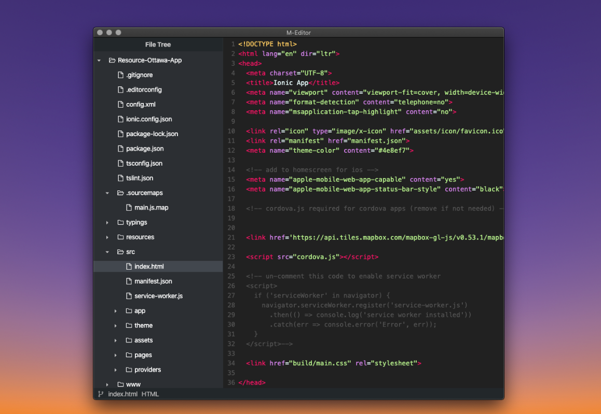

# M-Editor

M-Editor is a revolutionary text editor that supports multiple languages and has multiple features like:

* Syntax Hilighting
* Git Support (Add, Pull, Commit, Init)
* Command Pallete (shortcut)
* Color Picker
* Context Menus
* Image Viewer
* File Tree
* ~~Autocomplete~~

More features to come!!!

